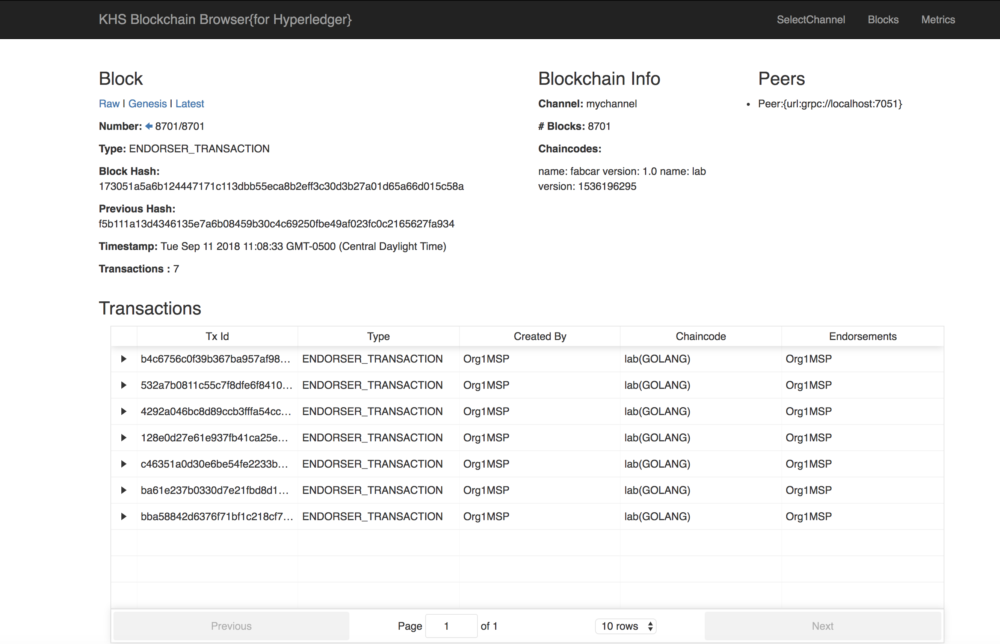

# khs-blockchain-browser
KHS Blockchain Browser


React/Node.js web application that allows ledger channel blockchains in Hyperledger Fabric to be browsed and searched.




## Installation 

`Prerequisites:` Node.js 

1. Clone repo
2. Install Server and UI javascript modules 

```
    $ npm install 
    $ cd ui
    $ npm install 
    $ cd ..
```

3. Modify the `config.js`,  so that the `network_url` property points to a peer node address and an admin `USERID` property references an admin user and public/private keys located in the `hfc-key-store` folder.

```
    module.exports = {
        port: process.env.PORT || 4001,
        host: process.env.HOST || "localhost",
        loglevel: process.env.LOGLEVEL || "info",
        wallet_path: process.env.KEYSTORE || "../hfc-key-store",
        user_id: process.env.USERID || "PeerAdmin",
        network_url: process.env.NETWORK_URL || "grpc://localhost:7051"  
    }
```

Here's an example public/private and user file in the `hfc-key-store` directory. 


4. Start the Api Server and UI server with the following commands 

```
    $ ./runApiServer.sh 
    $ cd ui 
    $ npm start 
```

UI will open on port `https://localhost:8080` by default, you can change by editing the `./ui/package.json` file.     


